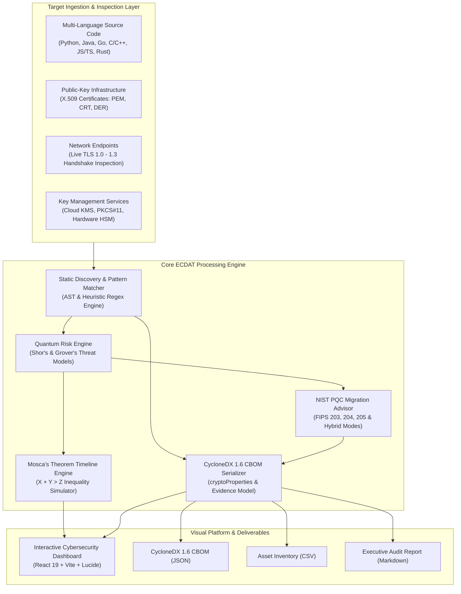

# Enterprise Cryptographic Discovery & Analysis Tool (ECDAT)

[](https://ntro.gov.in)
[](#)
[](https://cyclonedx.org)
[](https://csrc.nist.gov/projects/post-quantum-cryptography)
[](#)

Enterprise Cryptographic Discovery & Analysis Tool (ECDAT) is an automated **Cryptography Bill of Materials (CBOM)** discovery, quantum vulnerability assessment, and post-quantum migration planning platform engineered for defense, government, and mission-critical enterprise environments.

Developed for the **National Technical Research Organisation (NTRO)** under SIH Problem Statement **26164**, ECDAT enables automated identification of cryptographic assets across heterogeneous codebases, binaries, certificates, and network protocols, calculates systemic quantum collapse risks via **Mosca's theorem**, and provides automated **NIST Post-Quantum Cryptography (PQC)** upgrade playbooks.

---

## Architecture Overview



---

## Core Capabilities

### 1. Cryptographic Artefact Discovery & Cataloguing
- **Multi-Language Coverage**: Scans Python, Java, C/C++, Go, JavaScript, TypeScript, Rust, C#, PHP, Shell, and configuration manifests (`.yaml`, `.json`, `.properties`).
- **Cryptographic Primitives Catalogued**:
  - **Asymmetric Encryption & Key Exchange**: RSA (1024, 2048, 3072, 4096), ECC (ECDSA, ECDH, secp256k1, prime256v1), Diffie-Hellman, Ed25519, X25519.
  - **Symmetric Ciphers**: AES (128, 192, 256 in CBC, GCM, CTR, ECB modes), 3DES, DES, Blowfish, RC4, ChaCha20-Poly1305.
  - **Hash Functions**: MD5, SHA-1, SHA-256, SHA-384, SHA-512, SHA3, BLAKE3.
  - **Protocols**: SSL 3.0, TLS 1.0, TLS 1.1, TLS 1.2, TLS 1.3.
  - **X.509 Certificate Parser**: Public key extraction, signature algorithms, OID mappings, validity periods.
  - **Post-Quantum Primitives**: ML-KEM-768, ML-DSA-65, SLH-DSA, LMS/XMSS, Hybrid X25519MLKEM768.

### 2. Quantum Threat Modeling (Shor's & Grover's Algorithms)
- **Shor's Algorithm Exposure**: Detects asymmetric public key systems vulnerable to complete polynomial-time decryption and digital signature forgery on a Cryptographically Relevant Quantum Computer (CRQC).
- **Grover's Algorithm Exposure**: Identifies symmetric ciphers and hashing algorithms where quantum quadratic search speedup halves effective security bits (e.g., AES-128 reduced to 64-bit brute-force difficulty).
- **Harvest-Now-Decrypt-Later (HNDL) Analysis**: Automatically highlights high-confidentiality data in transit susceptible to immediate adversary interception for retrospective quantum decryption.
- **Quantum Vulnerability Index (QVI)**: A unified 0–100 risk score weighting cryptographic asset criticality, mathematical vulnerability, and transition margins.

### 3. Mosca's Theorem Risk Simulation
Implements the canonical quantum transition inequality:

$$\text{Mosca Condition: } X + Y > Z - \text{CurrentYear}$$

Where:
- **$X$ (Data Shelf-Life)**: Years confidential data must remain secure.
- **$Y$ (Migration Duration)**: Years required to rewrite, test, and deploy post-quantum algorithms across infrastructure.
- **$Z$ (CRQC Horizon)**: Projected arrival year of cryptographically relevant quantum computing capability.

The built-in interactive simulator enables real-time slider adjustments, visualizes the collapse window on a 2026–2045 timeline, and dynamically recalculates asset vulnerability states.

### 4. NIST Post-Quantum Cryptography (PQC) Recommendation Advisor
Maps every discovered legacy cipher to NIST-standardized replacements:

| Legacy Cryptographic Primitive | Recommended NIST PQC Replacement | Standard Specification | Quantum Security Level | Key / Ciphertext Overhead | Latency Impact |
|---|---|---|---|---|---|
| **RSA-1024 / RSA-2048 (Encryption)** | **ML-KEM-768** (formerly Kyber) | NIST FIPS 203 | Category 3 (AES-192 equiv.) | +1088 bytes encapsulation | Up to 5x faster key exchange |
| **RSA-2048 / RSA-4096 (Signatures)** | **ML-DSA-65** (formerly Dilithium) | NIST FIPS 204 | Category 3 | +2420 bytes signature | Comparable verification |
| **ECDSA (secp256k1 / P-256)** | **ML-DSA-65** / **SLH-DSA-128s** | NIST FIPS 204 / 205 | Category 3 / 1 | +3293 bytes signature | Slightly higher MTU footprint |
| **ECDH (X25519 / P-256)** | **Hybrid X25519 + ML-KEM-768** | IETF Hybrid RFC 9370 | Category 3 | +1184 bytes public key | Sub-millisecond overhead |
| **AES-128-CBC / GCM** | **AES-256-GCM** | NIST SP 800-38D | Category 5 (128-bit quantum) | 0 bytes overhead | < 1% difference with AES-NI |
| **3DES / DES / RC4 / Blowfish** | **AES-256-GCM / ChaCha20-Poly1305** | NIST FIPS 197 / RFC 8439 | Category 5 | Modern authenticated AEAD | 6x faster than legacy 3DES |
| **MD5 / SHA-1** | **SHA-384 / SHA-512 / SHA3-384** | NIST FIPS 180-4 / 202 | Category 4 | +28 to +32 bytes digest | Hardware accelerated |
| **TLS 1.0 / 1.1 / 1.2** | **TLS 1.3 with Hybrid ML-KEM** | RFC 8446 & IETF Draft | Category 3 | Modern PQC key share | 0-RTT / 1-RTT handshake |

### 5. Standardized CycloneDX 1.6 CBOM Export
Generates standards-compliant Cryptography Bill of Materials in JSON, compliant with the CycloneDX 1.6 schema:
- Component type: `cryptographic-asset`
- Specialized properties: `cryptoProperties`, `algorithmProperties`, `parameterSetIdentifier`, `quantumSecurityLevel`, `threatModel`
- Evidence traceability: exact file paths, line numbers, and extracted code occurrences.
- Export formats: **CycloneDX 1.6 JSON**, **Asset Inventory CSV**, and **Executive Audit Markdown**.

---

## Repository Structure

```
c:/Projects/sih/
├── backend/
│   ├── api.py                    # FastAPI REST routes, CORS, and export handlers
│   ├── models.py                 # Pydantic schemas for CBOM, Mosca, and PQC
│   ├── requirements.txt          # Python dependencies
│   ├── analyzer/
│   │   ├── pqc_advisor.py        # NIST PQC migration knowledge base
│   │   └── quantum_risk.py       # Shor, Grover, and Mosca's theorem risk engine
│   ├── cbom/
│   │   └── cyclonedx.py          # CycloneDX 1.6 CBOM, CSV, and Markdown generators
│   ├── scanner/
│   │   ├── engine.py             # Multi-language static code discovery engine
│   │   └── cert_scanner.py       # X.509 certificate and remote TLS inspector
│   ├── samples/                  # Bundled multi-tier enterprise target projects
│   │   ├── legacy_bank/          # Legacy Python core (RSA-1024, DES, MD5, TLS 1.0)
│   │   ├── enterprise_service/   # Java service (RSA-2048, ECDSA, ECDH, AES-128)
│   │   └── quantum_safe_app/     # Quantum-resilient app (ML-KEM, ML-DSA, AES-256)
│   └── tests/
│       ├── test_scanner.py       # Pytest unit and integration test suite
│       └── e2e_test.py           # Automated end-to-end user workflow test suite
│
├── frontend/
│   ├── src/
│   │   ├── App.jsx               # Navigation shell and state management
│   │   ├── index.css             # Cyber-defense dark theme design system
│   │   ├── main.jsx              # React 19 application root
│   │   └── components/
│   │       ├── ExecutiveDashboard.jsx # QVI radial gauge, KPI stats, Mosca alert
│   │       ├── ScanConsole.jsx        # 1-Click demo, local path, and TLS scanner
│   │       ├── CBOMExplorer.jsx       # Searchable CBOM table & code modal
│   │       ├── MoscaSimulator.jsx     # Interactive X + Y > Z timeline sliders
│   │       ├── PQCAdvisor.jsx         # NIST replacement cards & refactoring guide
│   │       └── ExportCompliance.jsx   # CycloneDX 1.6 JSON, CSV, and MD downloads
│   ├── index.html                # HTML entry point with typography
│   ├── package.json              # React 19, Vite, and Lucide icons
│   └── vite.config.js            # Reverse proxy configuration
│
└── README.md                     # Comprehensive technical documentation
```

---

## Installation & Setup

### Prerequisites
- **Python**: Version 3.10+ (tested on Python 3.12.7)
- **Node.js**: Version 18+ (tested on Node.js v22.20.0 with npm 11.7.0)
- **Git**

### 1. Clone the Repository
```bash
git clone https://github.com/krishnaMittal23/sih-p2.git
cd sih-p2
```

### 2. Backend Setup
Install Python dependencies:
```bash
pip install -r backend/requirements.txt
```

Launch the FastAPI backend server:
```bash
python -m uvicorn backend.api:app --host 127.0.0.1 --port 8000
```
- API Documentation (Swagger UI): `http://127.0.0.1:8000/docs`
- Health Endpoint: `http://127.0.0.1:8000/api/health`

### 3. Frontend Setup
In a separate terminal, navigate to the `frontend/` directory and install packages:
```bash
cd frontend
npm install
```

Launch the Vite development server:
```bash
npm run dev -- --host 127.0.0.1 --port 5173
```
- Interactive Web GUI: `http://127.0.0.1:5173`

---

## REST API Specification

### `GET /api/health`
Checks engine status and loaded standard profiles.
```json
{
  "status": "healthy",
  "service": "Enterprise Cryptographic Discovery & Analysis Tool (ECDAT)",
  "organization": "National Technical Research Organisation (NTRO)",
  "pqc_standard": "NIST FIPS 203, 204, 205",
  "cbom_spec": "CycloneDX 1.6"
}
```

### `GET /api/scan/demo`
Executes an immediate scan on the bundled multi-tier enterprise repository.
- Query Parameters: `data_shelf_life_x` (default: 10.0), `migration_time_y` (default: 3.0), `crqc_year_z` (default: 2030).
- Response: Complete `ScanResult` containing summary metrics, inventory list, Mosca evaluation, and PQC recommendations.

### `POST /api/scan`
Scans an arbitrary local directory or file path.
- Request Body:
```json
{
  "target_path": "C:\\path\\to\\source\\repo",
  "data_shelf_life_x": 10.0,
  "migration_time_y": 3.0,
  "crqc_year_z": 2030
}
```

### `POST /api/scan/remote`
Performs live network inspection and TLS handshake against a remote domain.
- Request Body:
```json
{
  "host": "api.gateway.internal",
  "port": 443
}
```

### `POST /api/mosca/simulate`
Recomputes Mosca risk without re-reading disks.
- Query Parameters: `scan_id`, `data_shelf_life_x`, `migration_time_y`, `crqc_year_z`.

### `GET /api/cbom/export/{scan_id}?format={cyclonedx|csv|markdown}`
Exports the CBOM in the requested format:
- `cyclonedx`: Application/json CycloneDX 1.6 file.
- `csv`: Text/csv inventory table.
- `markdown`: Executive audit report.

---

## Testing & Verification

### Running Automated Unit Tests
```bash
python -m pytest backend/tests -v
```
Verifies algorithm detection, key-size extraction, quantum risk scoring, Mosca inequality logic, and CycloneDX structure.

### Running End-to-End Workflow Tests
```bash
python backend/tests/e2e_test.py
```
Exercises all 8 end-to-end integration workflows:
1. Backend service health check
2. Frontend bundle delivery
3. Discovery scan execution
4. Quantum threat classification (Shor vs Grover)
5. Mosca simulator recalculation
6. NIST PQC advisor recommendation mapping
7. CycloneDX 1.6 CBOM schema validation
8. CSV & Markdown report generation

---

## Compliance & Standards Alignment

- **NIST Post-Quantum Cryptography Standardization**:
  - **FIPS 203**: Module-Lattice-Based Key-Encapsulation Mechanism Standard (ML-KEM)
  - **FIPS 204**: Module-Lattice-Based Digital Signature Standard (ML-DSA)
  - **FIPS 205**: Stateless Hash-Based Digital Signature Standard (SLH-DSA)
  - **SP 800-208**: Recommendation for Stateful Hash-Based Signature Schemes (LMS/XMSS)
- **OWASP / CycloneDX**: CycloneDX 1.6 Cryptographic Asset Extension Specification (CBOM).
- **IETF**: RFC 9370 & Hybrid Post-Quantum Key Exchange for Transport Layer Security (TLS 1.3).
- **NSA CNSA 2.0**: Commercial National Security Algorithm Suite 2.0 quantum migration timeline milestones.
